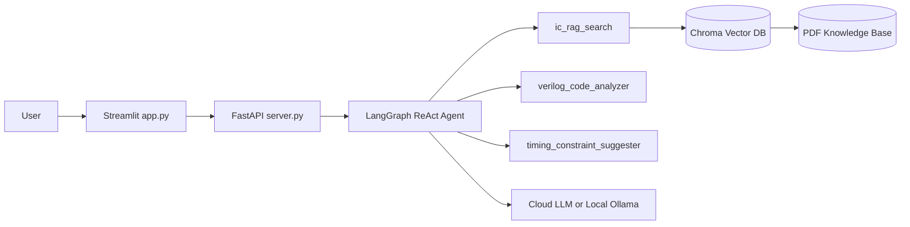

# IC-Expert Agent Infra

面向集成电路知识问答与工程辅助的 ReAct + RAG Agent 项目，重点不是“能答”，而是“可追责、可评测、可部署”。

## 项目定位

- 场景：IC 领域问答、Verilog 代码审查、时序约束建议
- 目标：在保证回答质量的同时，约束幻觉与伪引用
- 形态：FastAPI 后端 + Streamlit 前端 + Chroma 向量库 + Docker 部署

## 结果导向亮点（面试可讲）

- 严格模式拒答：检索未命中时固定模板拒答，禁止模型自由补答
- 引用可追责：服务端在输出前强制重写参考资料，仅保留真实检索来源
- 伪引用抑制：正文中出现未检索来源时自动净化，并提示“指定来源未命中”
- 知识库一致性自检：向量库 source 与 data 目录不一致时自动重建，避免陈旧脏数据
- 评测闭环：RAGAS 四指标 + 自定义 citation_correctness / refusal_correctness

## 系统架构



## 核心工程设计

### 1) 两种运行模式（环境解耦）

- 本地开发模式（默认云端 LLM）
- Docker 部署模式（默认本地 Ollama）

通过 APP_ENV 自动加载分层配置，避免本地与 Docker 混用变量：

- .env.dev
- .env.docker
- .env.prod

加载规则实现见 env_config.py。

### 2) 可追责回答链路

- 检索命中：回答正文可由模型生成，但参考资料由服务端程序接管
- 检索未命中：固定拒答模板，避免“看似正确但无依据”的自由发挥
- 指定来源未命中：明确提示未命中来源，防止用户误判

### 3) 评测与质量指标

基础 RAGAS 指标：

- faithfulness
- answer_relevancy
- context_recall
- context_precision

自定义工程指标：

- citation_correctness：引用是否真实来自本轮检索结果
- refusal_correctness：未命中时是否按严格模式拒答

## 快速开始

### 依赖安装

```bash
make install
```

### 本地开发（默认 APP_ENV=dev）

```bash
make run-local
```

或分开启动：

```bash
make run-api
make run-ui
```

访问：

- FastAPI: [http://127.0.0.1:8000/docs](http://127.0.0.1:8000/docs)
- Streamlit: [http://127.0.0.1:8501](http://127.0.0.1:8501)

### Docker 部署（固定读取 .env.docker）

```bash
make docker-up
make docker-logs
```

停止：

```bash
make docker-down
```

## 评测使用

运行评测：

```bash
python evaluate_ragas.py
```

输出：

- ragas_evaluation_report.csv（总指标）
- ragas_evaluation_details.csv（逐条明细）

## 仓库结构（关键文件）

- server.py：API 与流式输出、引用重写与正文净化
- rag_core.py：Agent、工具路由、严格模式
- llama_index_rag.py：向量检索与 source 一致性自检
- app.py：Streamlit 前端与本地会话管理
- evaluate_ragas.py：离线评测与自定义指标
- docker-compose.yml：API + Streamlit 编排
- Makefile：一键命令入口

## 面试讲解建议（3 分钟）

1. 先讲问题：RAG 常见风险是伪引用和未命中误答
2. 再讲方案：严格拒答 + 服务端引用接管 + source 一致性校验
3. 最后讲结果：可追责、可评测、可部署，支持本地与 Docker 双模式
